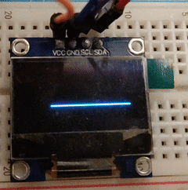

## Demo

## Description
This program shows basic usage of SSD1306 OLED display on the FRDM board.

## Requirements
* Freescale FRDM-KL25Z development board with CMSIS-DAP debug/programming app

* SSD1306 128x32 OLED display

## Connection Scheme
| Device Pin  | FRDM-KL25Z Pin |
|-------------|----------------|
| OLED SCL    | PTB0           |
| OLED SDA    | PTB1           |